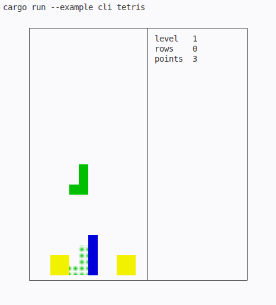

# MicroGames

[](https://crates.io/crates/microgames)
[](https://docs.rs/microgames)
[](https://github.com/t4ce/MicroGames)

MicroGames is a `no_std` business-logic layer for tiny games.



It is designed for the part of a game that should not care whether the screen is
a terminal, a framebuffer, a GPU window, a serial shell, an embedded display, or
a custom OS UI. You plug in input, random numbers, events, and output; the crate
keeps the rules, state transitions, scoring, and board queries.

Current game engines:

- Tetris-like falling blocks
- Snake
- Minesweeper
- Bejeweled-style match 3
- Chess move/state logic

## Shape

The crate is intentionally small and direct:

- `#![no_std]`
- no allocator requirement for the core engines
- fixed-size const-generic boards
- deterministic `RandomSource` trait
- event traits for sounds, score changes, row clears, mine reveals, food spawns,
  and game-over hooks
- query methods for renderers, terminals, tests, and custom shells

The library does not own your event loop or output target. Your platform drives
ticks and inputs, then renders from the game state.

```rust
use microgames::{Lcg32, NoopEvents, Rotation};

let mut rng = Lcg32::new(0xC11C_7E75);
let mut events = NoopEvents;
let mut game = microgames::Game::<10, 24, 4>::new(&mut rng, &mut events);

game.move_left();
game.rotate(Rotation::Cw);
game.soft_drop(&mut rng, &mut events);

for y in game.hidden_rows()..game.height_total() {
    for x in 0..game.width() {
        let cell = game.cell_view_at(x, y, true);
        let _ = cell;
    }
}
```

## Events And Output

Events are callbacks owned by the integration layer. For Tetris:

```rust
use microgames::{Rgb8, TetrisEvents};

struct AudioAndFx;

impl TetrisEvents for AudioAndFx {
    fn on_block_placed(&mut self, color: Rgb8, x: usize, y: usize) {
        let _ = (color, x, y);
    }

    fn on_music(&mut self, track_id: u8) {
        let _ = track_id;
    }
}
```

That is the main contract of MicroGames: the library decides what happened; your
platform decides what it means visually, audibly, or operationally.

## CLI Proof

The included CLI example is a small std shim around the same `no_std` shell
adapter used by older TRUEOS UI demos:

```bash
cargo run --example cli_tetris
```

It is deliberately plain. The interesting part is that the game logic and shell
renderer do not depend on std, TRUEOS, or a particular terminal backend.

## Documentation

- API docs: <https://docs.rs/microgames>
- Crate page: <https://crates.io/crates/microgames>

## Publishing Check

Before publishing:

```bash
cargo test
cargo run --example cli_tetris
cargo package --list
cargo publish --dry-run
```
